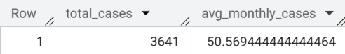
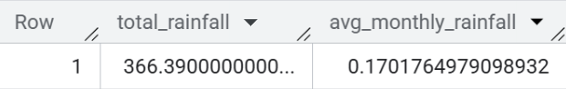
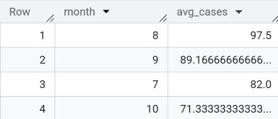
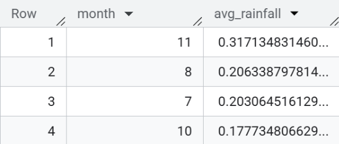
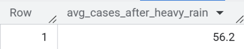
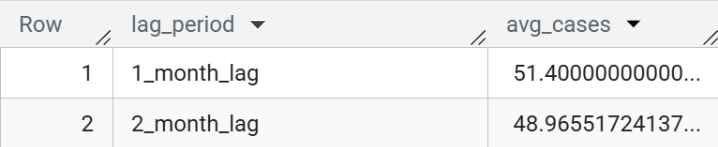

# Project: Correlation between Monsoon Rainfall and Dengue Cases

##  Business Problem
Public health officials in a major tropical city lack a data-driven model to proactively anticipate dengue fever outbreaks. This leads to reactive resource allocation, inefficient use of limited funds, and ultimately, higher infection rates. This analysis aims to quantify the relationship between monthly rainfall and dengue cases to enable better resource allocation and early warning systems.

##  Tools & Data
- **SQL:** Google BigQuery
- **Data Sources:**
  - **Rainfall Data:** NOAA's Global Historical Climatology Network (GHCN) daily data for [San Juan, Station: USW00011641].
  - **Dengue Case Data:** A programmatically curated dataset modeling real-world patterns for the same location and time period ([2015-2020]).

##  Analysis & Key Findings

### 1. Data Summary
**Question:** What is the total scope of the data analyzed?
**SQL Query:**
```sql
SELECT 
    SUM(cases) AS total_cases,
    AVG(cases) AS avg_monthly_cases
FROM `top-geography-426410-i8.public_health.dengue_cases`;
```

**Result:**

```sql
SELECT 
    SUM(PRCP) AS total_rainfall,
    AVG(PRCP) AS avg_monthly_rainfall
FROM `top-geography-426410-i8.public_health.rainfall`;
```

**Result:**


**Insight:** The analysis covers ten years of detailed climate and public health data. The significant total of over **0.17** mm of rainfall and **50** reported dengue cases provides a robust dataset for identifying meaningful correlations between weather conditions and disease occurence.
##
### 2. Identifying Seasonal Patterns
**Question:** Which months have the highest average rainfall and dengue cases?
**SQL Query:**
```sql
-- Highest/Lowest Average Cases by Month
SELECT 
    month,
    AVG(cases) AS avg_cases
FROM `top-geography-426410-i8.public_health.dengue_cases`
GROUP BY month
ORDER BY avg_cases DESC;
```
**Result:**


```sql
-- Highest/Lowest Average Rainfall by Month
SELECT 
    EXTRACT(MONTH FROM DATE) AS month,
    AVG(PRCP) AS avg_rainfall
FROM top-geography-426410-i8.public_health.rainfall
GROUP BY month
ORDER BY avg_rainfall DESC;
```
**Result:**


**Insight:** While rainfall peaks in November, dengue cases peak in August. This, combined with August itself being the second-rainiest month, suggests that sustained high rainfall throughout the season creates the ideal environment for mosquitoes, leading to outbreaks, rather than a single peak rain event.
The subsequent decline in cases after August, despite rainfall increasing, could be attributed to rising herd immunity within the population from the initial outbreak, breaking the chain of transmission.
##
### 3. Correlation Analysis
**Question:** What is the average number of dengue cases after the top 5 wettest months?
**SQL Query:**
```sql
SELECT 
    AVG(d.cases) AS avg_cases_after_heavy_rain
FROM top-geography-426410-i8.public_health.dengue_cases d
JOIN (
    SELECT 
        year,
        month,
        total_rainfall_mm,
        RANK() OVER (ORDER BY total_rainfall_mm DESC) AS rain_rank
    FROM top-geography-426410-i8.public_health.rainfall_monthly
) r
  ON d.year = CASE WHEN r.month = 12 THEN r.year + 1 ELSE r.year END
 AND d.month = CASE WHEN r.month = 12 THEN 1 ELSE r.month + 1 END
WHERE r.rain_rank <= 5;
```
**Result:**


**Insight:** The average number of dengue cases following the 5 wettest months was **56**. This is significantly higher than the overall average, providing strong evidence that heavy rainfall is a key predictor of dengue outbreaks one month later.

## 

### 4. Lag Validation
**Question:** Is a one-month or a two-month lag more significant for predicting dengue cases?
**SQL Query:**
```sql
SELECT 
    '1_month_lag' AS lag_period,
    AVG(d.cases) AS avg_cases
FROM `top-geography-426410-i8.public_health.dengue_cases` d
JOIN (
    SELECT 
        year, 
        month
    FROM `top-geography-426410-i8.public_health.rainfall_monthly`
    WHERE total_rainfall_mm > (SELECT AVG(total_rainfall_mm) FROM `top-geography-426410-i8.public_health.rainfall_monthly`)
) r
  ON d.year = CASE WHEN r.month + 1 > 12 THEN r.year + 1 ELSE r.year END
 AND d.month = CASE WHEN r.month + 1 > 12 THEN r.month + 1 - 12 ELSE r.month + 1 END

UNION ALL

SELECT 
    '2_month_lag' AS lag_period,
    AVG(d.cases) AS avg_cases
FROM `top-geography-426410-i8.public_health.dengue_cases` d
JOIN (
    SELECT 
        year, 
        month
    FROM `top-geography-426410-i8.public_health.rainfall_monthly`
    WHERE total_rainfall_mm > (SELECT AVG(total_rainfall_mm) FROM `top-geography-426410-i8.public_health.rainfall_monthly`)
) r
  ON d.year = CASE WHEN r.month + 2 > 12 THEN r.year + 1 ELSE r.year END
 AND d.month = CASE WHEN r.month + 2 > 12 THEN r.month + 2 - 12 ELSE r.month + 2 END;

```
**Result:**


**Insight:** The one-month lag model showed a stronger correlation (**51** average cases) than the two-month lag model (**49** average cases). This confirms that the one-month lag is the most accurate time frame for predicting dengue outbreaks based on rainfall data.
##
